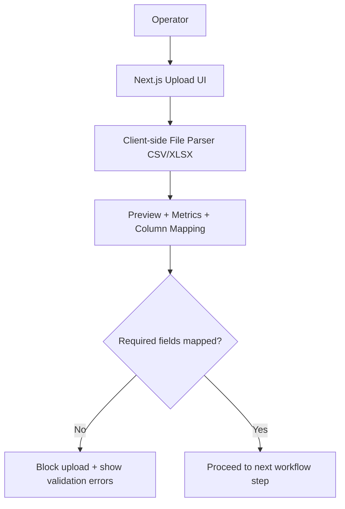
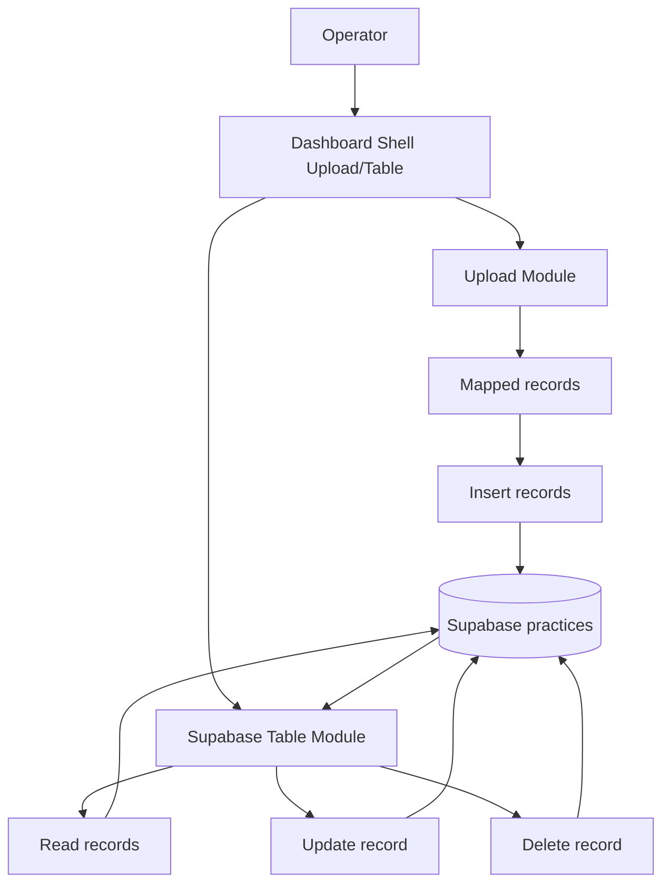
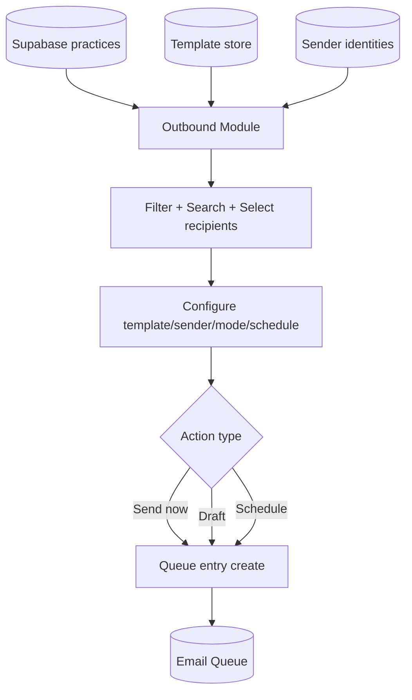
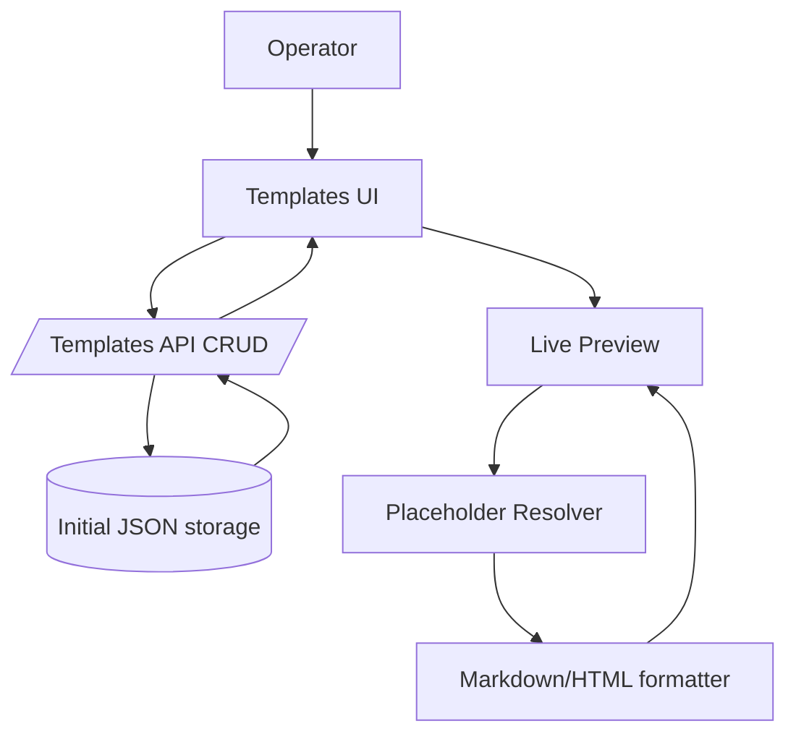
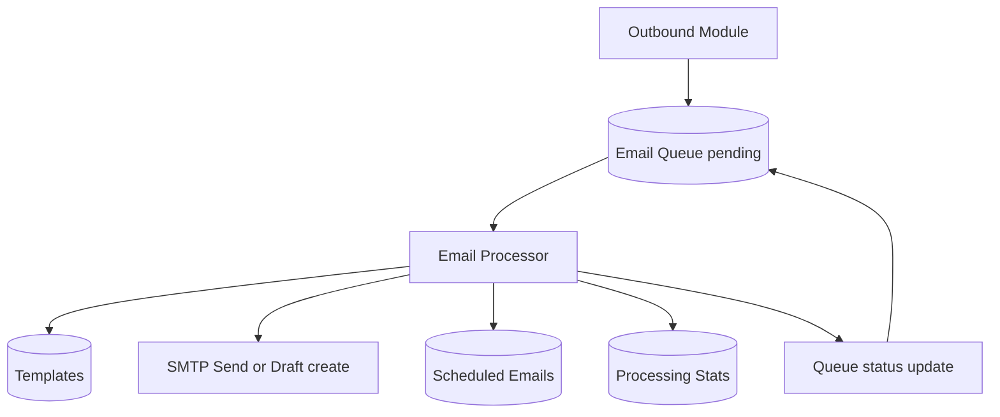
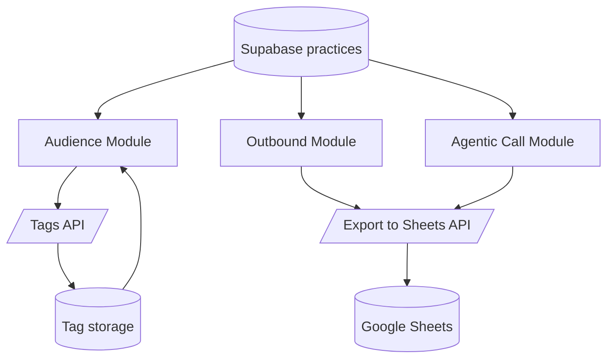
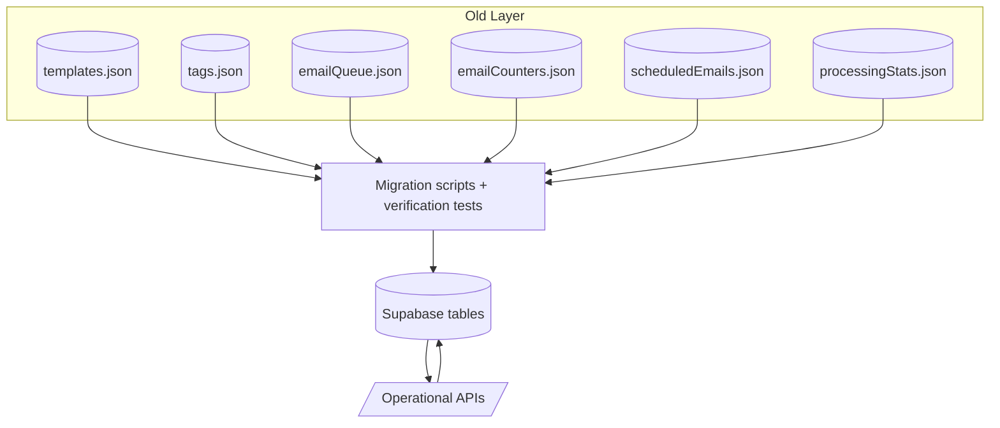
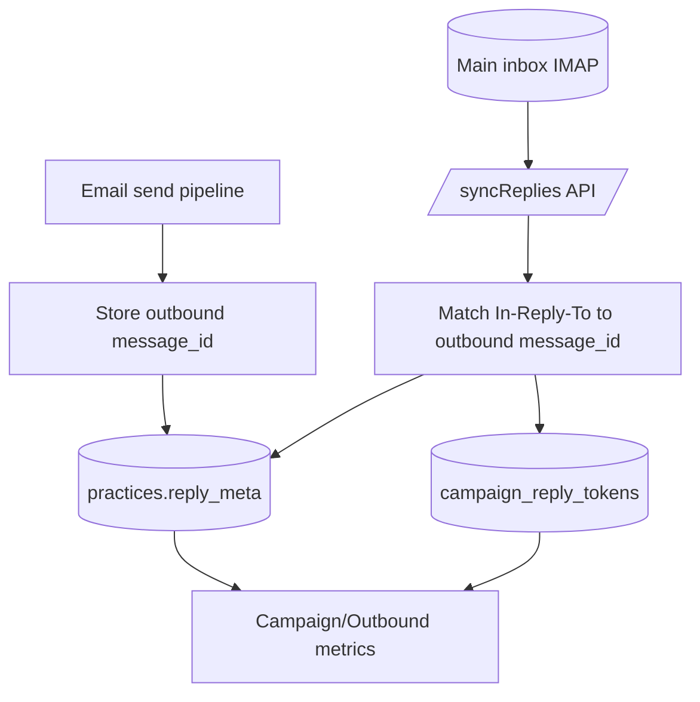
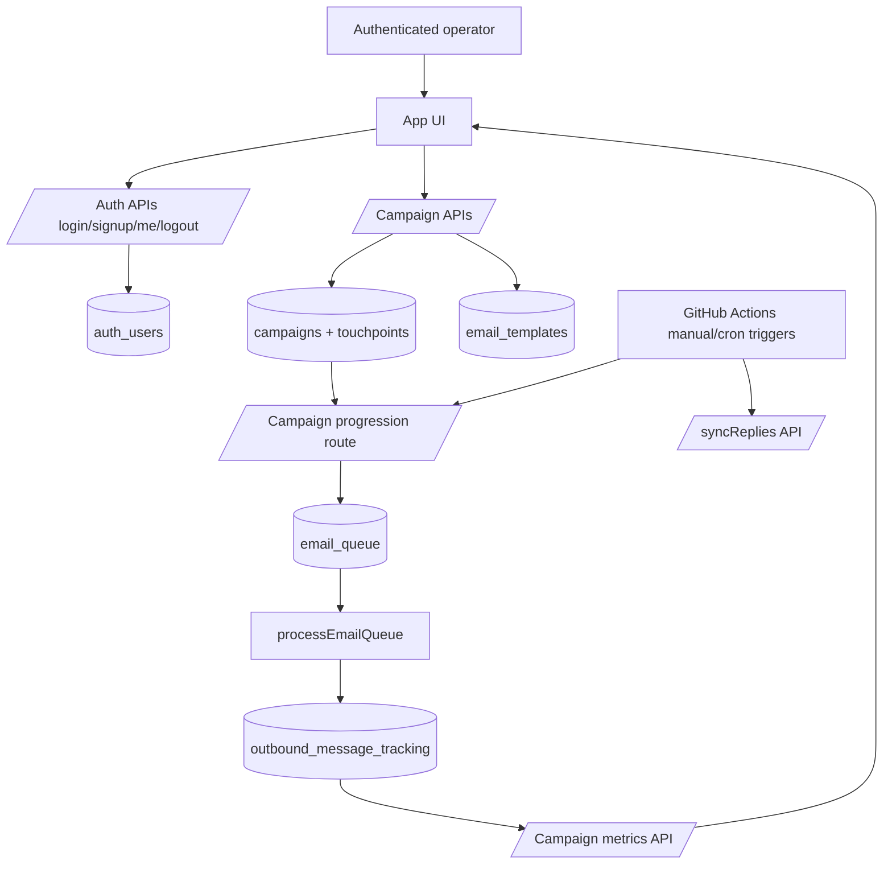
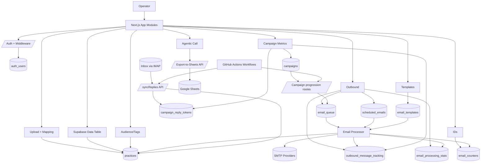

## Introduction

I built Dental Scout Live because I had a practical business problem: I needed a way to turn messy practice data into real outbound activity without relying on a patchwork of spreadsheets, scripts, and manual follow-ups. The goal was simple to say but hard to execute: upload contact data, clean it, manage it, segment it, send campaigns, and track what happened after sending.

I worked on this project solo as a junior developer. That reality shaped the code and the decisions. I moved fast, I made mistakes, I overbuilt some parts, I rewrote others, and I had to keep fixing reliability issues while still adding features. This write-up is the actual path, not a polished fantasy version.

## The Initial Architecture & Assumptions

I started from a fresh Next.js app and immediately replaced boilerplate UI with a focused intake flow for CSV/Excel uploads. My first assumption was that if I could prevent bad input early, I could avoid a lot of backend pain later.

So the first architecture looked like this:

- A client-side upload UI with file-type switching (CSV vs Excel).
- File parsing in-browser for preview and metrics (columns, row count, size).
- Required field mapping before upload.
- A simple dashboard shell to separate "upload" from "data table" work.

That assumption was mostly correct. The validation and mapping step did reduce garbage input. But I underestimated how quickly the problem would expand from "upload correctness" to "full operational workflow."

## Tech Stack and Why I Chose It

I did not pick tools to look modern on a resume. I picked them because I needed to ship quickly, keep the stack understandable as a solo developer, and still support real operational workflows.

### Frontend and App Runtime

- **Next.js (App Router)**  
  I used Next.js because I wanted one framework for UI, APIs, and deployment. That let me build screens and backend routes in the same codebase and avoid context-switching between multiple repos.

- **React**  
  The product UI became state-heavy very fast: table editing, filters, pagination, queue actions, template preview states, campaign forms. React's component/state model made this manageable.

- **Tailwind CSS + custom UI primitives + Radix-based components**  
  I needed speed and consistency. Tailwind helped me move fast. Component primitives (buttons, dialogs, inputs, switches, tables) kept behavior reusable while the product surface grew.

- **Framer Motion / motion packages**  
  I used these for targeted UX improvements (animated search and interaction polish), not as a core requirement. The intent was usability in dense screens, not visual novelty.

### Data, Storage, and Backend

- **Supabase (Postgres + client SDK)**  
  This became the backbone because I outgrew local JSON writes. I needed concurrent-safe writes, reliable querying, and persistence that works in production/serverless contexts. Supabase gave me that while staying approachable as a junior solo dev.

- **Next.js API routes**  
  I kept business logic in route handlers because it was the fastest path for me to ship features incrementally and keep auth checks close to endpoint behavior.

- **JSON files (early phase only)**  
  I initially used JSON as a speed hack to validate flows quickly (templates, queue, counters, tags). That was useful for early iteration but not good enough once workflows became concurrent and operational.

### Messaging and Integrations

- **Nodemailer + SMTP**  
  I needed direct control over sending behavior, queue processing, and sender identity handling. SMTP integration was practical and gave me immediate execution ability.

- **IMAP (imapflow)**  
  Once sending worked, I needed reply-state feedback. IMAP sync let me scan inbox replies and connect them back to outbound message IDs.

- **Google Sheets API**  
  I added this because real operations often still happen in Sheets. Export capability made the platform easier to plug into existing internal workflows.

### Security and Access

- **JWT (jose), bcryptjs, middleware enforcement**  
  I implemented first-party auth because internal tools still need clear access control. Password hashing + signed tokens + route protection gave me a workable security baseline without outsourcing auth early.

- **Cron secrets and workflow-trigger headers**  
  Automation endpoints needed explicit protection. I added shared-secret checks to avoid exposing queue processing/progression routes.

### Tooling and Operational Scripts

- **Migration/test scripts**  
  As I moved from JSON to Supabase, scripts were not optional. They were the only safe way to migrate data in phases and confirm behavior after each move.

- **GitHub Actions workflows**  
  I used Actions for timed/manual operational jobs (campaign progression, reply sync). It made execution reproducible and visible outside local runtime.

In short, this stack was justified by one constraint: I was building alone and needed fast iteration without losing control of data integrity and operations.

## Architecture Evolution Data Flow (Stage-by-Stage)

Below is the exact architecture evolution as data flow diagrams. I am showing how data moved at each major stage, including where I changed storage, APIs, and operational controls.

### Stage 0 — Initial Intake Prototype

### Stage 1 — Data Operations Dashboard (Supabase CRUD)

### Stage 2 — Outbound Workbench (Per-row + Bulk Send Planning)

### Stage 3 — Template Lifecycle System (CRUD + Rendering Rules)

### Stage 4 — Queue Processor Pipeline (Intent vs Execution)

### Stage 5 — Multi-Module Expansion (Audience, Tags, Agentic Call)

### Stage 6 — Storage Migration Pivot (JSON Writes Removed)

### Stage 7 — Reply Intelligence Loop

### Stage 8 — Campaign Orchestration + Auth + Controlled Automation

### Final Architecture — End-to-End Operating System

## Architectural Decisions I Made (and Why)

This is the part that mattered most in practice. The code changed a lot, but the key decisions were architectural.

### 1) Decoupling "send intent" from "send execution"

I moved from direct action buttons to a queue model because immediate sends are risky in real workflows. With queueing, I could:

- capture intent first,
- run validations and status transitions,
- process in controlled batches,
- and preserve a trace of what happened.

This decision enabled scheduling, retries, status metrics, and safer automation.

### 2) Migrating from file writes to database-backed state

I started with JSON writes because it let me move quickly at the beginning. But once multiple modules depended on shared state, file writes became fragile.

I migrated domain by domain (templates, tags, queue, counters, scheduled emails, stats) instead of doing one big rewrite. That made rollback and debugging possible. It was slower than a big-bang migration but much safer.

### 3) Making templates campaign-centric

At first, templates were generic artifacts. That became hard to manage as campaigns gained touchpoints and progression rules. I shifted to campaign-linked templates so each touchpoint had explicit template association. This reduced ambiguity and made campaign metrics meaningful.

### 4) Adding observability as a first-class feature

I initially treated status tracking as secondary, then realized that was wrong. Operators need to know queue depth, failures, processed counts, and current run state. I added dedicated status routes and UI surfaces because "send happened or not" is not enough for operations.

### 5) Separating test automation paths from production paths

I introduced test-only progression behavior to iterate faster, but I also had to prevent test logic from leaking into production flow. I split routes/workflows, then simplified trigger strategy toward manual control while validating real behavior. That reduced accidental sends.

### 6) Treating reply tracking as part of delivery, not a separate report

Reply sync is not just analytics. It affects who should receive follow-ups. By storing outbound message IDs and matching `In-Reply-To`, I could update reply metadata directly in practice records and campaign token tables. That made progression logic smarter.

### 7) Retrofitting auth and route protection across a live feature surface

I added auth later than I should have. Once I did it, I had to audit many endpoints and handle human user access plus cron/system access in parallel. The final pattern (`requireAuth` vs `requireAuthOrCron`) was a direct result of that pressure.

### 8) Keeping UX consistency while architecture changed underneath

I did a broad UI refactor while backend complexity was growing. That was risky. The upside was a consistent interface system. The downside was repeated visual tuning and occasional regressions I had to patch quickly. I learned to make smaller visual passes after major backend shifts.

## The Evolution & Roadblocks

### 1) From upload screen to real data operations

**The problem:** Uploading data was not enough. I also needed to manage rows after import: edit records, delete wrong rows, and work with larger tables.

**My attempt:** I integrated Supabase and built a table flow that moved from read-only to full CRUD. Then I added pagination, search, and row-level actions.

**The friction:** I hit complexity earlier than expected. Once I added edit dialogs, delete confirmations, and pagination controls, the component got heavy quickly. I also had to keep UX consistent while changing data behavior.

**The resolution:** I modularized where I could, reused UI primitives, and accepted incremental refactors instead of trying one big cleanup. That kept features moving while reducing breakage risk.

---

### 2) From data operations to outbound execution

**The problem:** I had usable data but no execution engine. Business value only appears when outreach actually happens.

**My attempt:** I added an Outbound module with template selection, sender selection, send mode (send now / draft), scheduling options, and bulk actions.

**The friction:** I tried to add many controls fast: timezone helpers, per-row state, bulk state, scheduling logic, and selection behavior. The UI became dense, and I had to constantly balance flexibility vs clarity.

**The resolution:** I kept the control surface but introduced stronger structure: clearer sectioning, validation gates, and better defaults. I also wrote PRD/subtask docs to keep scope visible because ad hoc memory was not enough anymore.

---

### 3) Template management became a core system, not a sidebar feature

**The problem:** Outbound quality depends on reusable templates, but my initial template area was a placeholder.

**My attempt:** I built template CRUD with API routes and persistence. Then I expanded template authoring with formatting support, placeholder rendering, and richer preview behavior.

**The friction:** I started with local JSON-backed storage because it was fast for development. That worked short-term but became fragile as the system grew and as deployment constraints became real.

**The resolution:** I first stabilized the JSON version (empty-state handling, directory checks), then later migrated the whole stack to Supabase-backed persistence. Template behavior stayed intact while storage got more reliable.

---

### 4) Queue processing: I had to separate intent from execution

**The problem:** Immediate send actions are risky at scale. I needed traceability, scheduling, status tracking, and failure visibility.

**My attempt:** I introduced an email queue model and processor pipeline, then added status APIs, processed counters, and scheduled-email handling.

**The friction:** At this stage I had competing concerns: shipping features, keeping delivery safe, and debugging queue behavior. I also had transitional code where sandbox assumptions and production assumptions overlapped.

**The resolution:** I moved to a clearer queue lifecycle with explicit statuses and operational endpoints. Then I migrated queue-related persistence from JSON writes to Supabase tables to remove file-race issues and improve monitoring.

---

### 5) Major infrastructure pivot: removing JSON write dependencies

**The problem:** File-based writes were a production liability. As modules grew (templates, tags, queue, counters, scheduled emails, stats), this became an architectural bottleneck.

**My attempt:** I ran staged migrations for each subsystem with migration scripts, test scripts, and markdown runbooks.

**The friction:** This was repetitive and error-prone work. I had to remap fields, update APIs, verify old data, and make sure UI behavior did not regress. It was not flashy work, but it was the hardest reliability work.

**The resolution:** I completed the migration in domains, not all at once. That gave me rollback room and made debugging manageable. By the end, write-heavy operational state was database-backed and much safer.

---

### 6) Reply intelligence and campaign progression

**The problem:** Sending emails is one half of the loop. I needed to know who replied, and I needed campaign touchpoints to progress with rules.

**My attempt:** I added reply metadata on outbound sends, IMAP-based reply sync, campaign CRUD, touchpoints, and campaign metrics APIs. I also introduced progression workflows with cron-style triggers.

**The friction:** Automation boundaries were tricky. I had to separate test and production behavior, secure cron-triggered routes, and avoid unsafe coupling between progression and reply sync.

**The resolution:** I tightened auth for automation endpoints, split test/prod progression behavior, and later shifted important workflows to manual trigger control while validating behavior. That reduced accidental sends during early rollout.

---

### 7) Security and access control came later than ideal, but got serious

**The problem:** As capabilities expanded, unrestricted access became unacceptable.

**My attempt:** I added JWT-based auth routes (login/signup/me/logout), password hashing, middleware protection, edge-safe token utilities, and signup restrictions (allowed domains + invite token).

**The friction:** Retrofitting auth into an app that already has many APIs is tedious. Every route needed review. I also had to add auth-or-cron cases for system-triggered jobs.

**The resolution:** I made auth explicit in API patterns and middleware, then enforced restricted onboarding for internal use. It was a necessary hardening step even though it slowed feature velocity.

---

### 8) UI system overhaul while backend complexity was rising

**The problem:** As the app got heavier, usability started to degrade. Dense operational screens needed clearer visual hierarchy and better navigation.

**My attempt:** I rolled out a broad Liquid Glass-style design refactor, new typography, animated search primitives, improved file upload components, and floating dock navigation.

**The friction:** I changed too much too quickly at points. I had to tune blur levels, contrast, dialog behavior, and mobile interactions repeatedly. Some commits were basically visual correction passes.

**The resolution:** I kept iterating in small passes until screens were usable again under real workflow load. I also added design QA scripts and docs to reduce visual drift.

## Final Polish & Delivery

By the final phase, the project had moved far beyond the initial upload tool:

- Data ingestion with validation and mapping.
- Supabase-backed operational data management.
- Outbound module with bulk actions, scheduling, queueing, and template control.
- Campaign-level progression and metrics.
- Reply tracking with inbox sync.
- Audience/tag segmentation and external export workflows.
- Auth-protected product surface with controlled account creation.
- Unified UI system with responsive navigation across modules.

Business-wise, this changed the product from a "data prep utility" into an internal outbound operations platform. The direct impact was lower manual overhead, better send control, better reliability, and much better visibility into campaign outcomes.

From a delivery perspective, I also reached a better operational shape:

- migration guides existed for major storage transitions,
- test scripts existed for critical subsystem behavior,
- cron-driven and manual-trigger workflows had explicit boundaries,
- campaign and queue behavior were measurable, not opaque.

That matters because this project is not a static app; it is an operational system that people rely on during daily outbound execution.

## Retrospective & Real Learnings

The biggest lesson for me was that building solo means architecture is never static. I could not freeze design, backend, and workflows up front. I had to ship, observe friction, and refactor under pressure.

What I learned the hard way:

- Fast prototypes are useful, but temporary storage and quick APIs can become long-term risk if I do not budget migration time.
- Operational software needs observability early. Queue/status metrics should not be an afterthought.
- Automation must be treated carefully. Manual triggers are sometimes the right step while logic is still stabilizing.
- Security should come earlier. Adding auth late works, but it is more expensive.
- UI consistency matters in tools like this. If operators use the app daily, small interaction issues compound quickly.
- Documentation is part of engineering. Migration docs and runbooks reduced mistakes when I had to revisit flows weeks later.
- "Works locally" is not a definition of done for process-heavy features like sending, scheduling, and syncing.

### What I would do differently next time

If I rebuilt this from scratch today, I would make these changes earlier:

1. **Define persistence strategy on day one**  
   I would still prototype quickly, but I would set explicit exit criteria for temporary storage so migration does not become emergency work.

2. **Put auth and endpoint policy in place before feature explosion**  
   I would establish auth/authorization patterns early, including machine-to-machine access strategy for cron endpoints.

3. **Create a service layer sooner**  
   I kept a lot of logic in API routes while iterating. Next time I would extract domain services earlier to reduce duplication and make testing easier.

4. **Formalize campaign domain model earlier**  
   Campaigns, touchpoints, templates, sends, replies, and progression rules are tightly linked. I would define those contracts earlier so fewer mid-stream rewrites are needed.

5. **Make test and production paths impossible to confuse**  
   Separate route namespaces, naming, and guardrails from the start. I did this later, but earlier would have reduced risk.

6. **Track non-functional requirements as first-class tasks**  
   Rate limits, observability, error budgets, and operational alerts need explicit backlog space, not "later" status.

I am still proud of this build. It is not perfect, but it is honest engineering progress: start with a focused workflow, expand when business reality demands it, and harden the architecture when weak spots become clear.
