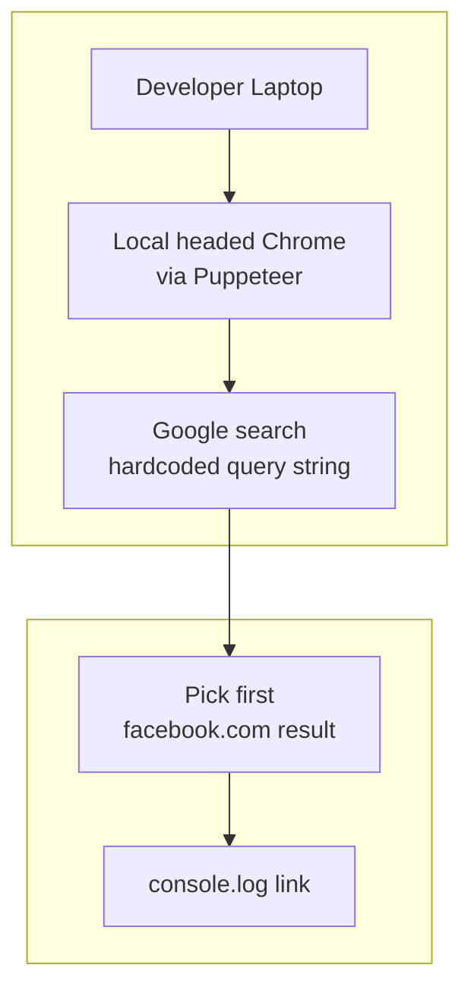
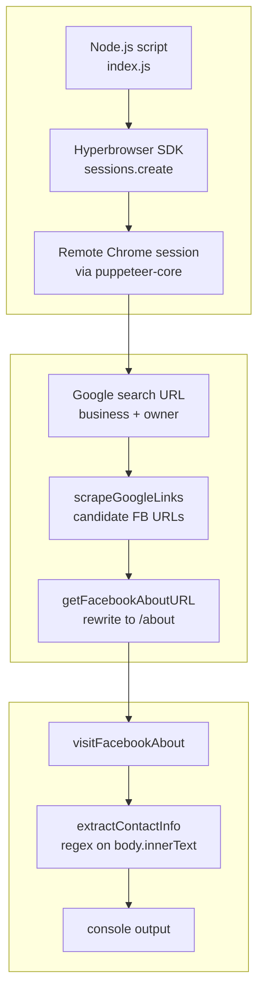
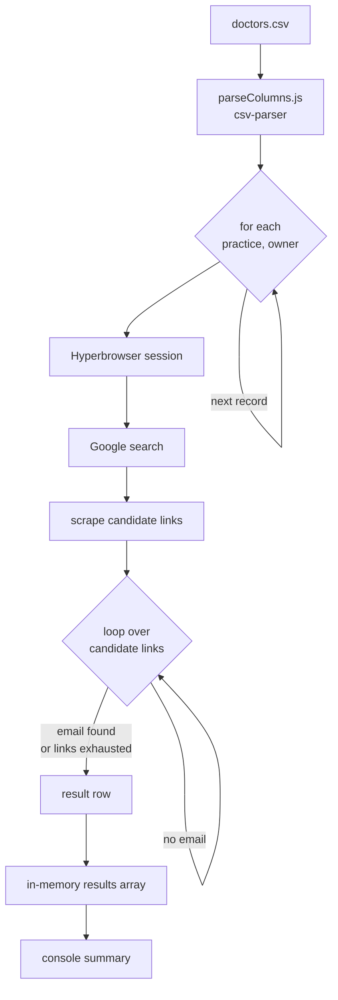
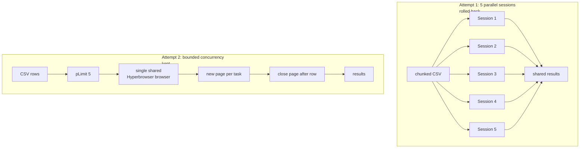
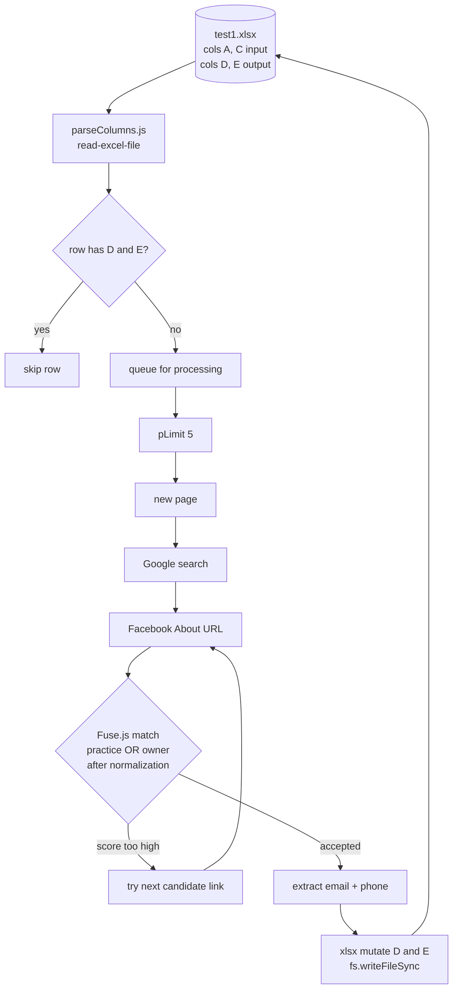
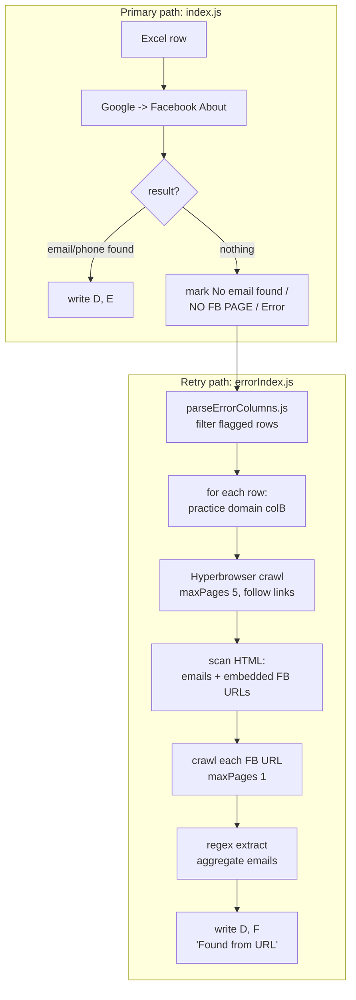
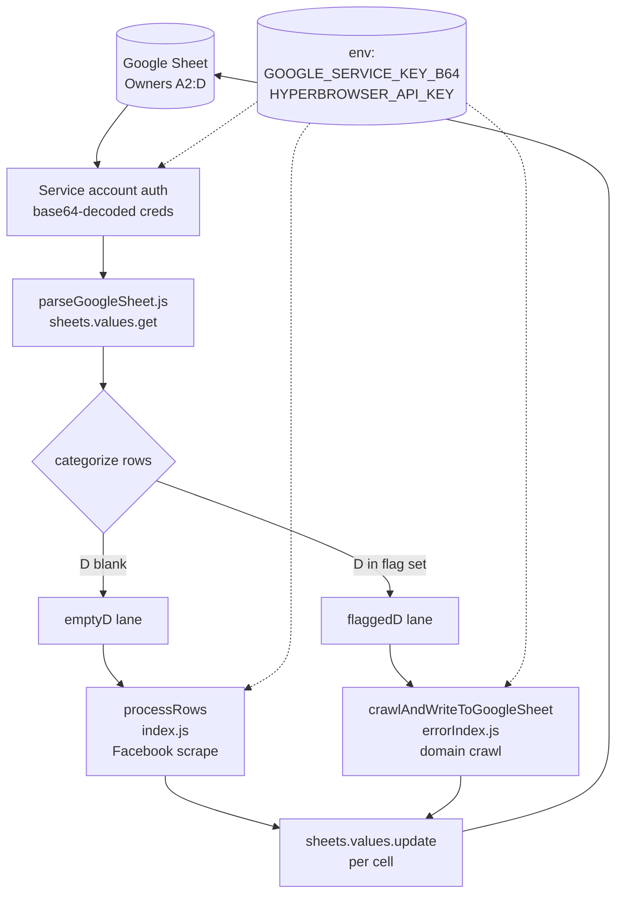
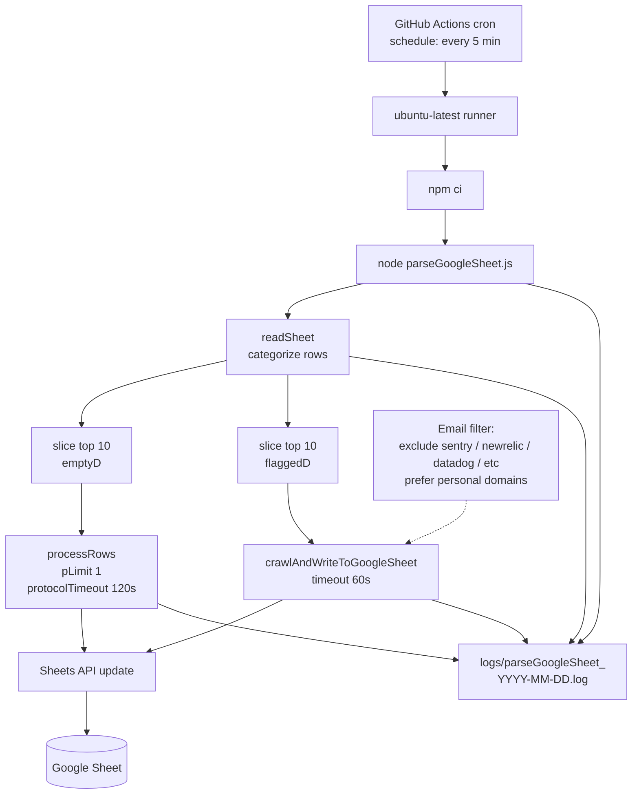
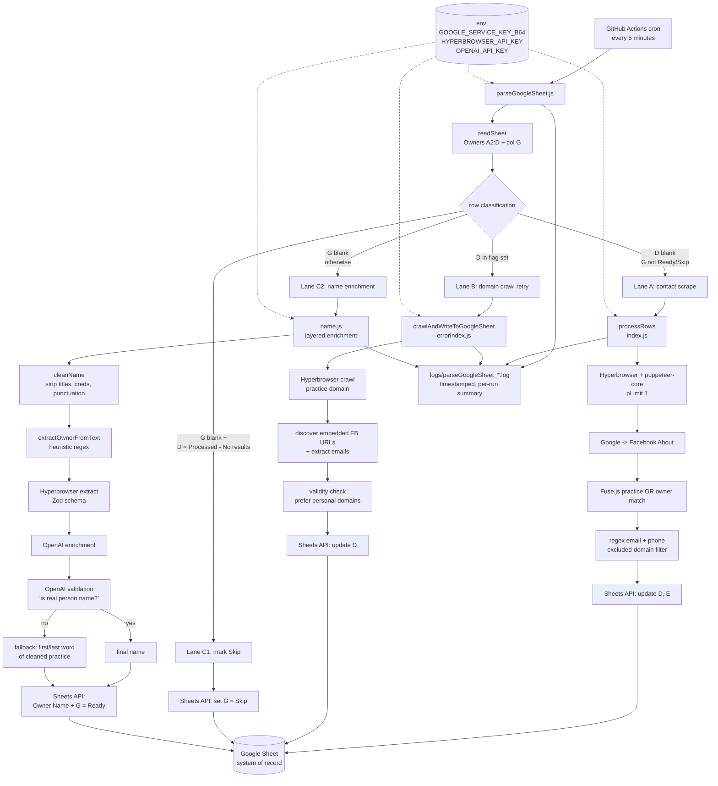

## Introduction

I'm a junior developer. I built DentalScout solo across 69 commits over a couple of months, and this post is a real account of how the project actually evolved — not the cleaned-up version. The product itself is narrow: take a list of dental practices and their owners, find the right Facebook page, and pull out emails and phone numbers so the sales team doesn't have to manually search and copy-paste for hours.

The business reason for it was simple. Manual prospecting at scale doesn't work. Somebody on the team would sit with a spreadsheet, type `site:facebook.com [practice name] [owner]` into Google, click the first result, scroll the About page, copy whatever email or phone they could find, and paste it back. Multiply that by a couple thousand rows. The cost wasn't just time — it was inconsistency, fatigue errors, and contacts that never got entered because the operator gave up halfway.

So I started writing a script. I assumed it would take a weekend. It did not.

This post covers seven distinct phases of the project, from the first Puppeteer prototype to the final cloud-hosted, status-driven pipeline with AI-assisted name enrichment. I'll be honest about what broke, what I overengineered, and what I had to rip out.

---

## The Initial Architecture & Assumptions

My starting assumption was that I needed three things: Puppeteer to drive a browser, Google search to find the Facebook URL, and a regex to grab emails. I wrote it that way. The first commit was around twenty lines of code. A local Puppeteer browser opened, typed a hardcoded query, waited for the Facebook link, and printed it.

**Diagram 1 — Day-one architecture (local Puppeteer prototype):**

I was wrong about how far that would get me.

The first real problem was that running headed Puppeteer locally is slow, fragile, and immediately flagged as bot-like by Google. After a couple of test runs I started getting consent screens and slower-loading result pages. So I switched the execution model. Instead of launching a local Chrome, I connected through Hyperbrowser, a managed remote browser session service. That single swap moved me from "this might work on my laptop" toward "this can run unattended somewhere else." It also let me set a stealth user agent without dealing with the noise of full stealth plugins.

Around the same time, I made a few other early choices that I now think were correct but accidental:

- I extracted emails and phone numbers by reading `document.body.innerText` and running two regexes against it. This is dumb-simple. It scaled later because I never had to maintain selectors.
- I switched from `await page.type()` (which simulates real keystrokes) to a direct URL navigation like `google.com/search?q=...`. This was a performance tweak, but it also reduced surface area for anti-bot triggers.
- I introduced canonical "About" URL rewriting (`facebook.com/PageName/about`) so I'd always land on the contact section instead of whatever the user posted last.

I refactored the script into helper functions: `setUserAgent`, `goToGoogle`, `acceptCookies`, `searchFacebookPage`, `scrapeGoogleLinks`, `getFacebookAboutURL`, `visitFacebookAbout`, `extractContactInfo`. Honestly, I did that more out of an instinct that the file was getting ugly than out of any plan for what came next. It paid off later, but it wasn't strategy.

**Diagram 2 — MVP after the Hyperbrowser swap (single-flow extraction):**

The one thing I got embarrassingly wrong here was secrets. I had the Hyperbrowser API key hardcoded in `index.js`. I knew it was wrong. I told myself "I'll fix it later." I fixed it much later, painfully, in public.

---

## The Evolution & Roadblocks

This section is the bulk of the story. I'll group changes by the business problem that forced them, because the technical changes alone don't make sense without that context.

### Roadblock 1: One prospect at a time is useless

The first version processed one practice per run. That doesn't help anyone. The whole point of the tool was to enrich a list, not look up a single name.

So I added CSV ingestion. I wrote a `parseColumns.js` module that read a `doctors.csv` file with practice names and owner names. The main loop then iterated record by record. This took about an hour to write and immediately broke in three ways:

1. The browser session would time out partway through a long run.
2. Some queries returned no Facebook links at all, and my code crashed instead of moving on.
3. Even when it found a link, the first result wasn't always the right business — I'd extract emails from someone else's page and write them as if they were correct.

I fixed the first two by wrapping each iteration in `try/catch` and resetting the page state between records. The third problem — matching the wrong business — I ignored for a while. I knew it was there. I just didn't have a good answer yet.

I also added a multi-link traversal: if the first Facebook result didn't yield an email, try the next one, and so on, with an early exit if anything was found. This raised the success rate noticeably but also made wrong-attribution worse, because now I was pulling from the second or third result, which was even less likely to be correct.

**Diagram 3 — CSV-driven sequential loop with multi-link traversal:**

### Roadblock 2: Sequential is too slow

With a few hundred rows, even at 15–20 seconds per row, the script ran for hours. I tried to parallelize.

My first attempt was to split the dataset into chunks and run five Hyperbrowser sessions concurrently using `Promise.all`. It worked, but it was crude. If one session got stuck, the others kept going, and I had no good way to track what had actually been processed. I also burned through API quota faster than expected because every session opened a fresh browser.

I rolled that back. The next attempt used `p-limit` to cap concurrency at five tasks against a single shared browser, opening a new page per task and closing it after. That was significantly more stable. The lesson here is that "true parallelism" sounds good on paper, but session-level isolation has real overhead, and most of my time was actually spent waiting on network, not CPU. A bounded concurrency model on one session got me most of the throughput at a fraction of the operational complexity.

**Diagram 4 — Concurrency evolution (multi-session attempt, then bounded p-limit):**

### Roadblock 3: CSVs don't fit how non-developers work

I shipped the CSV version to someone on the team. They asked, reasonably, why they couldn't just use an Excel file. They had one. With formatting. And five columns I didn't know about.

I switched to `read-excel-file` and `xlsx` for both reading and writing. This sounds trivial. It wasn't. The Excel file became both input and output: the script now read columns A (practice), C (owner), and wrote results into D (email) and E (phone). That meant:

- I had to introduce checkpoint logic: skip any row that already had values in D and E so I could resume after crashes.
- I had to handle the file being opened in Excel mid-run (which causes write failures).
- I had to be careful about the workbook buffer lifecycle. The first version wrote the workbook on every row, which slowed everything down. The second version still wrote on every record, but only because immediate persistence mattered more than speed.

The Excel writeback step felt like the moment the tool stopped being a script and started being a workflow. The operator no longer needed me to hand them a JSON file. They opened the same Excel they started with and the new columns were just there.

### Roadblock 4: Wrong-business attribution

This was the hardest correctness problem in the project. Even with multi-link traversal, the script would sometimes extract emails from a completely unrelated Facebook page that happened to share a keyword with the practice name.

I added page-name validation using Fuse.js. Before accepting any contact info, I'd compare the page's `h1` text against the target practice name with a fuzzy threshold. Initially I matched only against the practice name. Then I realized many dental practices are named after the dentist ("Diehl Dental" with Dr. Kathleen J. Diehl), and the `h1` often only showed one of them. So I extended the match to accept either the practice name or the owner name.

I also added normalization: stripping titles (Dr., DDS, DMD), business filler ("Inc", "LLC", "Dental", "Center"), punctuation, and even some city names that were polluting the comparison. The normalization rules were embarrassingly empirical — I added each one because I'd seen a specific false positive or false negative in the logs.

This is the kind of work that doesn't look like much in a diff but took the most actual thinking time. It's also the reason I now believe most scraping bugs are not "the scrape failed" but "the scrape succeeded with the wrong data."

**Diagram 5 — Excel-native pipeline with checkpoint resume and Fuse.js identity gate:**

### Roadblock 5: Errors need to be recoverable, not just logged

After several hundred runs, the output sheet had three categories of unresolved rows: "No email found", "NO FB PAGE", and "Error". I needed a way to retry those without reprocessing the entire dataset.

I wrote `parseErrorColumns.js` to filter rows with those specific markers, and I built a separate script (`errorIndex.js`) that handled them with a different strategy. Instead of going through Facebook, it crawled the practice's own website (column B — their domain) using Hyperbrowser's `crawl` API, scanned the resulting HTML for emails and any embedded Facebook URLs, and tried again from those discovered Facebook URLs.

This second-path crawler became unexpectedly important. A lot of practices either don't have an active Facebook page or don't surface contact info there, but they almost always have an email on their own site's footer or contact page. The recovery rate from this fallback was significant.

**Diagram 6 — Dual-path architecture: primary scrape + crawl-based retry:**

### Roadblock 6: Local Excel files don't work for a team

Once two people on the team wanted to use the tool, the Excel-file model fell apart. Whoever ran the script had the "real" copy. Everyone else worked off stale exports. I'd already been bitten by this twice.

I migrated to Google Sheets. This was the messiest single transition in the project. Specifically:

- I had to set up a Google Cloud service account, give it Sheets API access, and figure out how to authenticate from Node. I started with a `credentials.json` file. Then I realized I couldn't commit that or even safely email it. I converted it to a base64-encoded environment variable (`GOOGLE_SERVICE_KEY_B64`) and parsed it at runtime.
- I rewrote the writeback paths to call `sheets.spreadsheets.values.update` per cell instead of mutating a workbook buffer. This is slower per write but means the source of truth is always the cloud sheet.
- I rewrote the orchestrator (`parseGoogleSheet.js`) to read a specific range, categorize rows into "blank D" (never processed) and "flagged D" (failed), and pass each category into the right processing function.
- I had to handle the case where my base64 service key got truncated by a YAML quoting issue in GitHub Actions — which I'll get to in a moment.

I also did the embarrassing public commit-history dance around `.env` and `credentials.json`: removing them, adding them, removing them again, fixing the gitignore, and resolving merge conflicts that came from working across two environments. Anyone reading my git log can see exactly when I learned to take secret hygiene seriously.

**Diagram 7 — Google Sheets becomes the system of record:**

### Roadblock 7: Email quality

Even when extraction succeeded, the emails were sometimes useless. Footers of websites are full of:

- `sentry-next.wixpress.com` (error tracking)
- `newrelic.com`, `datadoghq.com` (monitoring)
- `noreply@...` and other system addresses

I added two filters: an excluded-domain list for monitoring/error services, and a personal-vs-business preference (prefer Gmail/Yahoo-style addresses when available, since for many dental practices the owner's personal email is more responsive than the generic `info@`). These were small filters but they directly translated to the sales team trusting the output.

### Roadblock 8: Running it on a schedule

By this point the script worked, but someone still had to run it. I wrote a GitHub Actions cron job that runs `parseGoogleSheet` every five minutes. The first version had the base64 credential pasted as a YAML literal block scalar. It deserialized incorrectly — the trailing newline got stripped, the JSON parse failed, and the action exploded with "Unexpected end of JSON input." I fixed it by including the trailing newline correctly in the YAML.

The cron version also has hardcoded API keys in the workflow file. I know. I marked the comment as "not recommended for production." I'll get to it.

**Diagram 8 — Scheduled execution and observability:**

---

## Final Polish & Delivery

The final phase wasn't about adding features. It was about making the project something I could leave running without watching it.

I added a logging module that writes timestamped entries to `logs/parseGoogleSheet_<date>.log` for every run, including row counts processed, row counts skipped, and row counts remaining. The Actions cron writes these to the runner, which I check occasionally. The first time I saw a clean log saying "Processed 10 empty rows (212 remaining)" I felt something I can only describe as relief.

I tuned the concurrency one more time. I dropped from 5 to 1 concurrent task because the protocol timeout errors from Puppeteer at higher parallelism were costing me more than they saved. With single-task processing plus increased `protocolTimeout` (120s) and `defaultNavigationTimeout` (60s), the per-run failure rate fell substantially. Throughput per run is lower than the parallel version, but the cron runs every five minutes, so cumulative throughput is fine and stability is much higher. This was a trade-off I would not have understood three months earlier.

I also removed every legacy artifact: `test1.csv`, `test1.xlsx`, `test2.xlsx`, `parseColumns.js`, `parseErrorColumns.js`, `doctors.csv`, `extracted_emails.json`. These were all useful at some point and then weren't. Cleaning them up made the repository feel done.

The last meaningful feature I added was a name-enrichment layer (`name.js`). The sales team didn't just want emails and phones; they wanted clean owner names for personalization in outreach. The source sheet had owner fields like `Dr. Kshama Kheny, DDS` or `Dr. Neal, Dr. Hittle, Dr. Tran` — messy, multi-person, or with credentials baked in. I wrote a layered enrichment pipeline:

1. Clean the existing owner string (strip titles, credentials, punctuation).
2. If that fails, try regex extraction from the practice name string.
3. If that fails, use Hyperbrowser's `extract` API with a Zod schema to pull a name from the practice's website.
4. If that fails, ask OpenAI to extract one real person's name from the available context.
5. Validate any candidate by asking OpenAI whether it's a real person's name.
6. If everything fails, fall back to the first or last word of the cleaned practice name.

Each successful name updates the sheet's "Owner Name" column and flips a "Status" column to `Ready` so downstream tools can pick the row up. I added a status column (G) that also lets the operator mark rows as `Skip` if they want them excluded. The parser now respects that.

This was the first time the project actually felt like a workflow tool rather than a script. The sheet became the interface: change a status, the cron job picks it up, results land in the same row, and the operator decides what to do next.

**Diagram 9 — Final architecture: status-driven, three-lane, with name enrichment and AI validation:**

---

## Retrospective & Real Learnings

A few things I'd tell myself if I were starting over.

**I overestimated parallelism and underestimated reliability.** Most of my early performance work was about going faster. Most of my actual gains came from staying alive longer. The single-task version of the script with proper timeouts and error handling outperforms the five-session parallel version on any realistic dataset, because half the parallel sessions would die.

**The hardest bugs were correctness bugs, not crashes.** Anyone can see a crash and fix it. The bugs where the script ran cleanly and wrote the wrong email for the wrong dentist into the wrong row were invisible until someone tried to use the output. Fuzzy matching, normalization, and identity validation took longer to build than the entire happy path of the scraper.

**Secrets should never have been in the first commit, period.** I'm not going to pretend I didn't put an API key in `index.js` on day one. I did. The cleanup was harder and more public than just doing it right would have been. Future me: `.env` and `.gitignore` are not optional, even on day one of a solo project.

**The Excel/Google Sheets pivot taught me what an "interface" really means.** I kept thinking of the input/output format as a technical detail. It wasn't. It was the entire user-facing contract. When the sales team didn't need to think about JSON, CSV, or files anymore — when they just opened their existing sheet and saw results filled in — that's when the tool became real.

**I refactored too late, every time.** Every helper extraction, every module split, every parser rewrite happened a few weeks after I should have done it. The pattern was always: "this file is fine, I'll just add one more thing." Then I'd add ten more things, then refactor under pressure. I'd rather refactor early and small.

**AI integration is most useful as a validator, not a primary tool.** The OpenAI calls in `name.js` aren't doing the work — they're checking the work. Regex and Hyperbrowser do the extraction. OpenAI answers a binary question: is this a real person's name? That use of an LLM was cheap, fast, and high-value. Using it for the primary extraction would have been slower, more expensive, and harder to debug.

**I should have written a `00-project-intent.md` on day one.** The closest I got was the git commit message of the first commit, which says "first commit." When I came back to the project after a week away, I sometimes couldn't remember what the column letters meant or what status values were canonical. Internal docs are not optional.

The project works. It runs on a five-minute cron, fills in a Google Sheet, and saves real hours of manual work every week. It's not impressive code. It's not architecturally pure. It's not the version I'd build now. But it shipped, and it's the first thing I've built end-to-end that someone other than me actually uses on purpose. That's the part I'm taking forward.
